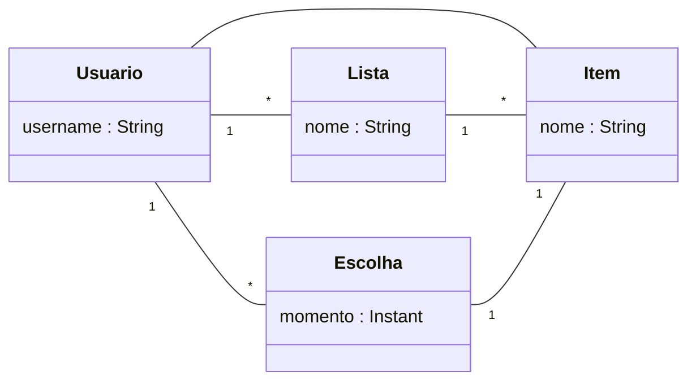

# presentes

```mermaid
classDiagram

direction LR

Usuario "1"--"*" Lista
Usuario -- Item
Lista "1"--"*" Item

Usuario "1"--"*" Escolha
Escolha "1"--"1" Item

class Usuario {
    username : String
}

class Escolha {
    momento : Instant
}

class Lista {
    nome : String
}

class Item {
    nome : String
}
```
